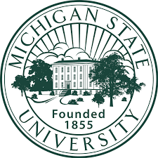

## My Education

Secondary Education: Grand Rapids Catholic Central High School

  Participated in numerous activities, such as varsity sports for tennis and baseball. Member of National Honors Society. Took a wide variety
  and number of AP and honors classes. Graduated Summa Cum Laude along with an award for excellence in Chinese and more.

Higher Education: Michigan State University

  Currently a junior at MSU studying computer engineering and working towards a bachelors degree. Member of Engineers for a sustainable
  world. Taken many relevant CSE and ECE classes applicable to a field in Coding or Computer Engineering.

